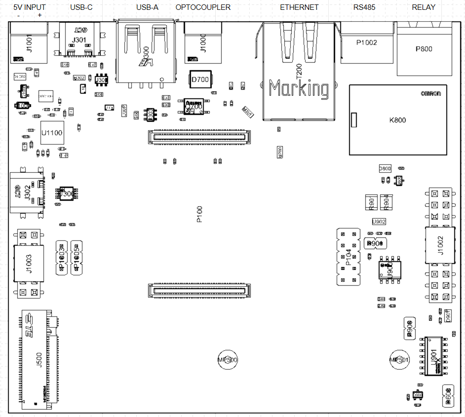

Getting started
====================

Hardware overview
-----------------------------

MAPIO hardware is based on multiple electronic boards to facilitate repair.
It is based on a `Raspberry Pi Compute Module 4 <https://www.raspberrypi.com/products/compute-module-4/>`_, adding integrated circuits and connectors to enhance features.

PCB1 is mandatory, and provide the following functions :

* Socket for Raspberry Pi Compute Module 4 (eMMC variants only)
* Slot for an M.2 SSD (2242 or 2280)
* Ethernet 1Gbps
* 1x USB-C 2.0 
* 1x USB-A 2.0
* Internal USB-C connector for debug purposes
* Optocoupled UART input for TIC (Linky)
* RS485 10 Mbps transceiver
* 250V 10A relay
* 5V Fan connector
* Jumpers for power supply selection
* Jumpers for Wifi/BLE/BOOT configuration

PCB2 is optional, but delivers the full potential of MAPIO :

* A 18650 backup battery, providing several hours of autonomy in case of power loss
* 3 slots for (optional) RF modules
* 2.13" black and white ePaper
* 3 RGB LEDs
* 3 buttons
* 3V3 DC-DC converter

Mechanical overview
-----------------------------

MAPIO has been designed to be installed on DIN rail.
The case is a customized version of `Bud DMB-4773 <https://www.budind.com/product/general-use-boxes/din-rail-mount-multi-board-box-series/dmb-4773/>`_.

You need to have at least 6 free spaces (108 mm) on your switchboard for MAPIO, plus space for AC-DC power supply. 9 free spaces are recommended.

Electrical specifications and installation
------------------------------------------

MAPIO has to be powered by a 5V DC, 2A power supply. The power input connector is on the upper left side of the casing.

You need to use the provided `Wurth 691361100002 connector <https://www.we-online.com/en/components/products/TBL_3_50_3611_VERTICAL_69136110000X>`_.

Connect the output of the AC-DC converter (for example, `Mean Well HDR-30-5 <https://www.meanwell.fr/alimentations-din-rail/ac-dc/5/2-4,3,5/ac-dc-ultra-slim-din-rail-power-supply-input-range-hdr--30--5>`_) to J1001 connector.

Note : the use of a 2A circuit breaker upstream of the AC-DC converter is highly recommended.

Jumper configurations
------------------------------------------

The main board has several configurations available. These configurations can be set by putting jumpers on the board headers.

+----------+------------------------------+
| Header   | Function                     |
+==========+==============================+
| P104     | Compute Module Configuration |
+----------+------------------------------+
| P901     | RS485 120R Configuration     |
+----------+------------------------------+
| P1003    | 5V Configuration             |
+----------+------------------------------+
| P1005    | 3V3 Configuration            |
+----------+------------------------------+

