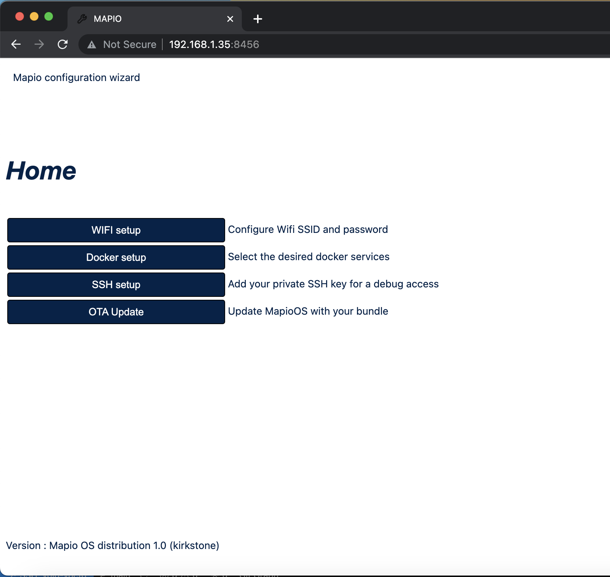

:orphan:

Update MAPIO OS
================

Flash layout
-------------
Here is the eMMC flash layout, with the size of each partition

.. code-block:: console

    mmcblk1      179:0    0   7.3G  0 disk
    |-mmcblk1p1  179:1    0    64M  0 part /boot
    |-mmcblk1p2  179:2    0   700M  0 part /
    |-mmcblk1p3  179:3    0   700M  0 part
    `-mmcblk1p4  179:4    0   5.8G  0 part /usr/local

.. list-table:: Partitions description
   :widths: 25 50
   :header-rows: 1

   * - Partition
     - Description
   * - mmcblk1p1
     - Boot partition containing bootloader (u-boot), kernel and device-tree. It is not updated during an OTA update.
   * - mmcblk1p2
     - Rootfs partition A (flop/flop mechanism for OTA updates)
   * - mmcblk1p3
     - Rootfs partition B (flop/flop mechanism for OTA updates)
   * - mmcblk1p4
     - Data partition containing user data (for example all docker data). It is not updated during an OTA update.

OTA update
-------------
OTA(Over The Air) system update is managed with RAUC tool (https://rauc.readthedocs.io/en/latest/).
It is using a symmetric model with two main partitions (A and B). A flip/flop mechanism between A and B is done at each update.
RAUC uses cryptographic signing and verification of updates using OpenSSL (signatures based on x.509 certificates).
An image update is called a bundle.

Check that the setup web server is running using the epaper interface.
The web server is automatically running at first boot and until it has been disabled.

With a navigator, go the address 
http://YOUR_LOCAL_IP/

You will see the following homepage:

Click on **OTA Update** then on next page click on **Choose file** and select the bundle.
The officials bundle (mapio-bundle-xxx.raucb) can be found here https://github.com/pcurt/yocto-build/releases

Then click on **update**, it will process the following actions:

*  Transfer the bundle on the target
*  Install the bundle using RAUC utility
*  Reboot the gateway
  
The update process will take a few minutes, look at the epaper screen to see when MAPIO is available again.
After the update, you can verify that the expected version has been installed on the setup web server or on the epaper screen.

.. warning::
    The bundles are signed image. You can only update the running OS with a bundle with the correct signature.
    If you want to build your own bundle as described in :doc:`OS Build <os-build>`, you need first to build your own full eMMC image with your own signature.

.. note::
    It is allowed to rollback with an old version with the same process.